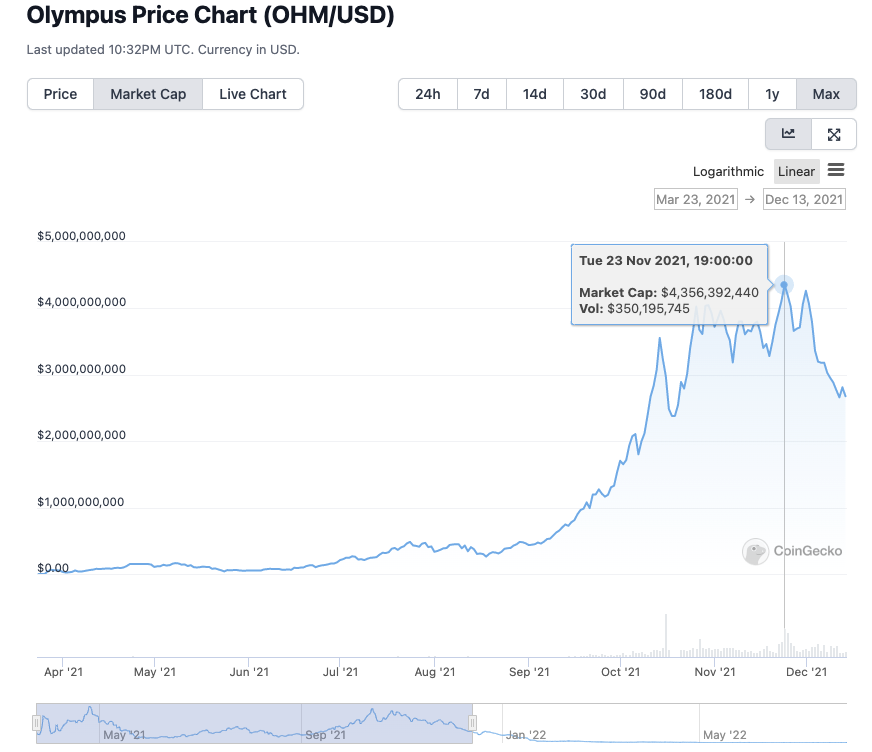

# DeFi Researcher
**The goals of the challenge are:**
- Demonstrating problem solving skills.
- Presenting the final result in an intelligent way.
- Proving your ability to query / read / interpret blockchain data.
- Demonstrating good communication throughout the challenge. You can ask as many questions as you need during the challenge, it is actually encouraged to ask questions.

**Here are some guidelines:**
- You can use any language and any packages you want to extract and present the data.
- We suggest asking for help in the Discords, Telegrams, or any other groups that have knowledge on the protocol you are investigating. DeFi is all about collaboration!
- Feel free to use any data or solutions that other people have already solved. Solving problems quick is always great, and if someone has already done the work, it is a good idea to use it. But you should always make sure the data is correct.

**Submission:**
- You can work on a private GitHub repo and then share it with **davekaj** GitHub user.
- Feel free to send any question while doing the exercise.
- Present over video your results. Display the graphs / charts / tables you created and explain what they mean.
- Show the code you wrote in order to clean the data, organize it, and pipe it into the charts or graphs.
- Explain areas you got stuck, and how you got past them.

# Challenge - Investigate $OHM bond purchasers profitability
## Background
Olympus DAO is a very exciting project. The way they launched the token was very unique - they were able to attract hundreds of millions of dollars in liquidity by offering discounted bonds to purchasers, and then offering immediate APY that was over 10000% at the start. 

However, the system was designed like this on purpose, and the team behind OHM was aware of the reflexive nature of the tokenomics. They knew it would eventually come down as fast as it went up.

At Ekonomia, we believe their strategy to gain TVL was brilliant - but they hurt a lot of their users that joined in late. We want to have a similar mechanism as Olympus, but protect the underlying principle of the users so that no one loses their initial investment. We want to learn how long the bond purchases were profitable for the users in order to estimate how long we might make our launch process last.

## Problem - Find the moment when bond purchasers started losing money
Investigate all bond purchases between March 2021 - November 2021:
 
 
 

The reason we pick November 2021 is because it is obvious the people who bought OHM bonds at this point lost money. Just by looking at the chart, we would assume the loss of profit happens sometime between September and November. But we would like you to find the exact date it first happens.

**Assumptions**
- Choose an appropriate data source for the daily $OHM price. Any will work - Coingecko, Coinmarketcap, a Subgraph or a Dune page that contain the price, etc.
- For simplicity sake, let's first just consider the price of the BOND, the capital they invested, and how much OHM they would have today if they immediately staked the OHM they got. This ignores the reality of each individual users actions, but it's okay. We want to see how the system performed, rather than each user.
- There is no need to go beyond the November 2021 data.

## Bonus problem
If you have extra time, you can investigate each user. Here are some things we would be interested in:
- Investigating if any users bonded and did NOT stake - which would be a very odd investment choice.
- Investigating how the OHM V1 bonds and OHM V2 bonds differed in immediate staking. The OHM V1 bonds were locked and not earning yield for 5 days. The V2 ones were minted through the bond and immediately staked, but not possible to unstake for 5 days. This is clearly more advantageous for the V2 bond purchases, but seeing the data would be interesting.
- Investigating each Ethereum accounts PNL on OHM bonds. This would look at the amount they paid, and how much the value is worth today if they are still holding, or how much it is worth when they sold it. You can look at the data up to the present day, or you can choose to stop at April 2022, when they started offering inverse bonds. The inverse bonds add more complexity that might make this challenge take too long.

### Useful resources and notes
- $OHM launched an original $OHM V1 token and now there is $OHM V2. You likely how to track bonds for both of these tokens.
- [$OHM minting and burning Dune dashboard](https://dune.com/CyJackX/OHM-Days-until-Supply-meets-RFV). This is helpful to visualize the minting and burning of OHM since Jan 2022. Please note, OHM has existed since March 2021, so there is some data missing here.
- [OHMs official subgraph](https://thegraph.com/hosted-service/subgraph/olympusdao/olympus-protocol-metrics).
- [OHM dashboard](https://app.olympusdao.finance/#/dashboard).
- [Subgrounds - A Pythonic data access layer for applications querying data from The Graph Network](https://github.com/Protean-Labs/subgrounds).

